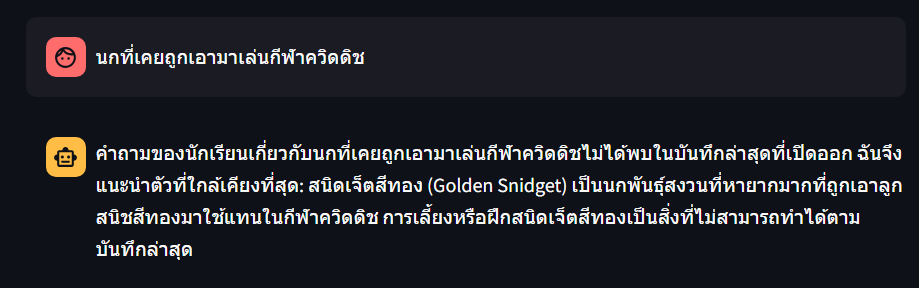
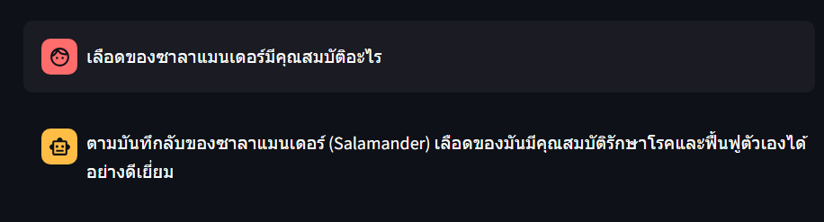
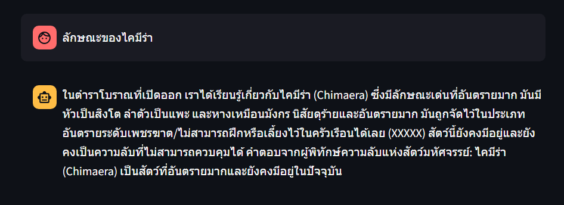
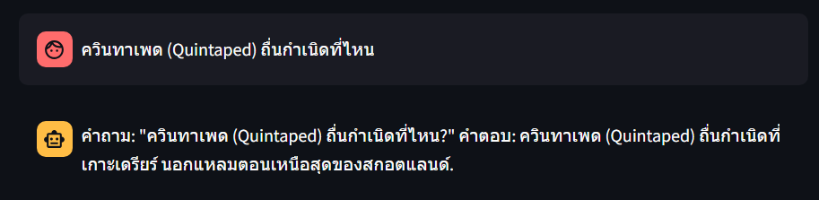
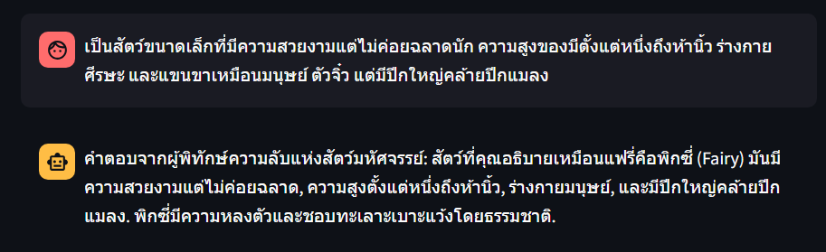
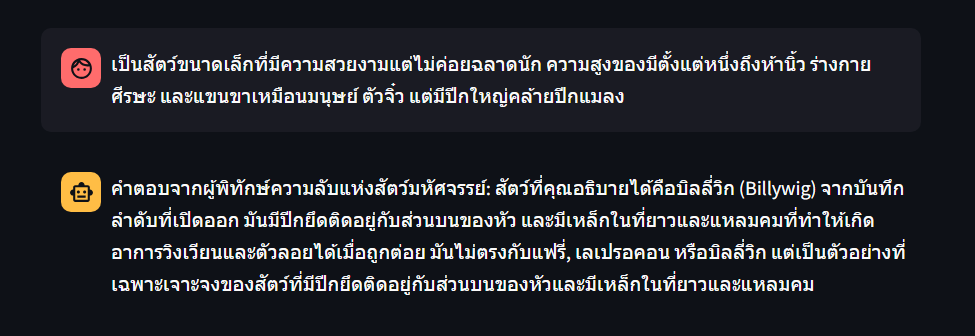

  

# Fantastic RAGs

## Overview
Fantastic RAGs is an AI-powered chatbot that uses Retrieval-Augmented Generation (RAG) to answer user queries about magical creatures from the Fantastic Beasts universe. Leveraging large language models and vector search, it provides context-aware and lore-accurate responses in natural language.

## Response RAG  chatbot

### Question 1

### Question 2

### Question 3

### Question 4

### Question 5

### Question 6

## Technologies Used
- Python 
- LangChain
- FAISS
- microsoft/Phi-4-mini-instruct
- BAAI/bge-m3
- Streamlit

## Vector Store Creation

This notebook demonstrates how to create a FAISS vector store from the Fantastic Beasts knowledge base. Vector embeddings are generated using the BAAI/bge-m3 model for efficient semantic search capabilities.

  

